# 한 줌(HANZOOM)

        

## 1. 서비스 설명

### 개요

- **진행 기간** : **2022.04.11 ~ 2022.05.20(6주)**

- 한줄 소개 : 위치기반 식재료 나눔/교환 서비스

- 서비스 명 : **한 줌(HANZOOM)**
  <br/>
  <br/>

## 2. 기획 배경

### 🖼 배경

- 1인 가구 수가 매년 증가하고 있는 가운데, 1인 가구의 식품 절반은 음식물 쓰레기로 버려진다고 합니다. 이는 식재료의 양이 혼자 사용하기 벅차거나 질리고 또, 조리법을 잘 몰라 식재료를 사용하지 않고 오래 보관하여 상하는 경우가 많기 때문입니다.

  이로 인해 사람들은 직접 해먹지않고 배달음식을 선택하게 되는데,이는 식비 증가의 부담과 동시에 음식물쓰레기뿐만 아니라 포장 용기로 인한 플라스틱 쓰레기 문제까지 이어지게 됩니다.
  <br/>

### 🎯 타겟

- 어떤 요리를 해야할지 모르는 사람

- 상해서 버리는 식재료가 많고 쉽게 식재료를 구하고 싶은 사람

- 여행이나 일정 등으로 빠르게 남은 식재료를 처리하고 싶은 사람

- 혼자 구매하기 양이 많아 걱정인 1인 가구
  <br/>
  <br/>

## 3. 서비스

### 📺 시연영상

[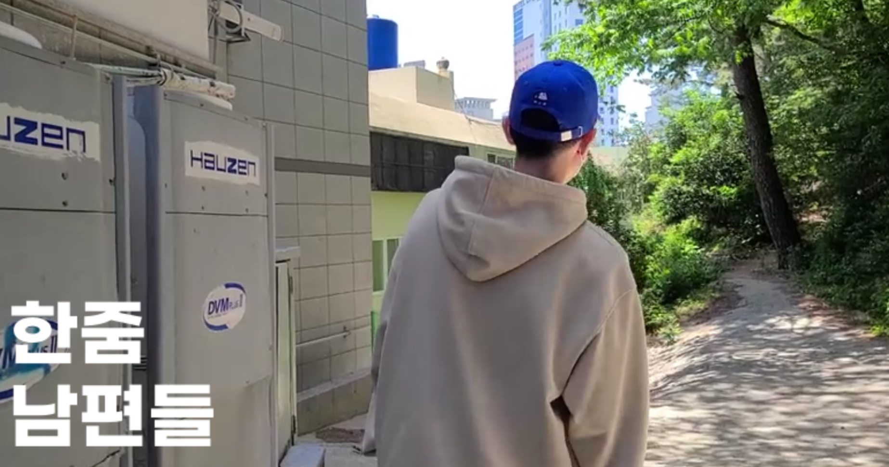](https://youtu.be/qdT0S32mmjo)

<br/><br/>

### 🛠 주요기능

### 메인페이지

- 메인 페이지에는 저희 사이트 기능을 소개하는 부분과 인기 게시글을 확인할 수 있습니다.


<br/><br/>

### 비밀번호 찾기

- **일반 회원** 사용자가 비밀번호가 기억나지 않을 시, 비밀번호 찾기를 통해 가입했던 메일로 랜덤 비밀번호를 받을 수 있습니다.


<br/><br/>

### 레시피 추천

- **My 식재료에 등록된 식재료 중 체크박스로 선택** 후 레시피 추천 버튼을 클릭하면 약 6만개의 레시피 데이터를 바탕으로, `자신이 소유한 식재료에 맞는 레시피를 추천`해줍니다.


<br/><br/>

### 식재료 관리

- 식재료 추가 및 게시글 등록


<br/>

<br/>

### 게시판

- 게시판


<br/>

- 게시글 상세

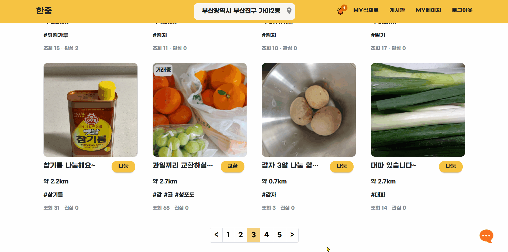

<br/>

<br/>

### 식재료 매칭

- 추천 레시피 &rightarrow; 자동 매칭 성공


<br/>

- MY 식재료(필요 목록) &rightarrow; 선택 매칭 성공


<br/>

- 매칭 성공 시, 결과 페이지


<br/>

- 추천 레시피 &rightarrow; 자동 매칭 실패

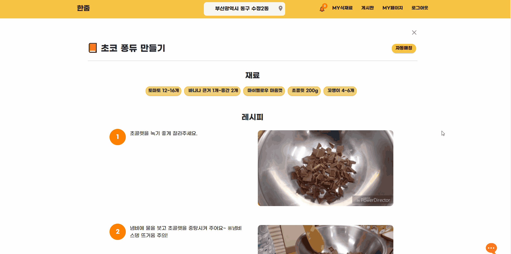
<br/>

- MY 식재료(필요 목록) &rightarrow; 선택 매칭 실패

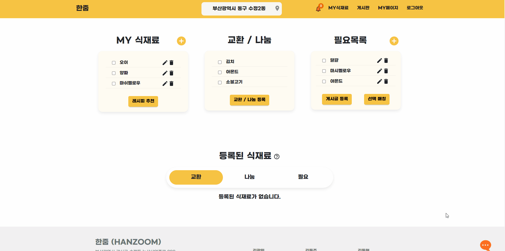

<br/><br/>

### 채팅

- 유저 간 1:1 실시간 채팅


<br/><br/>

### 일정

- 일정 잡기

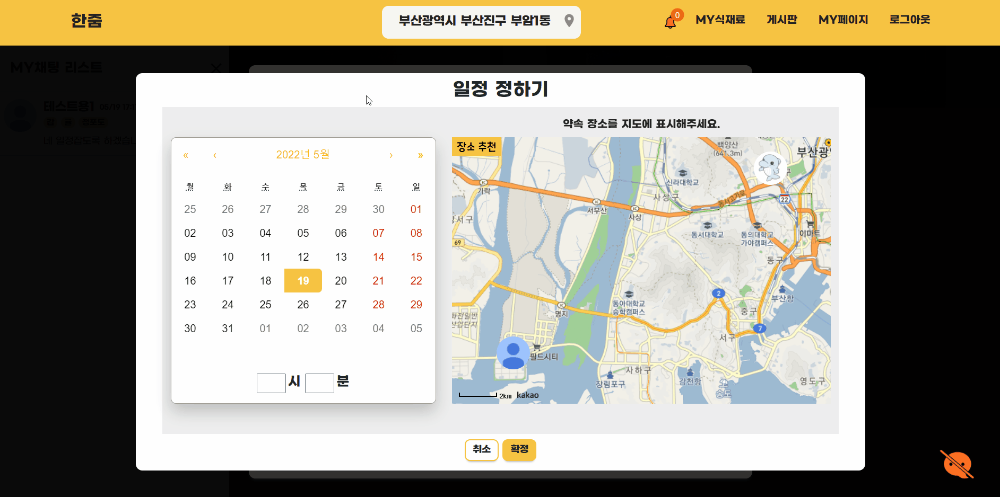

<br/>

- 일정 상세보기(공유)

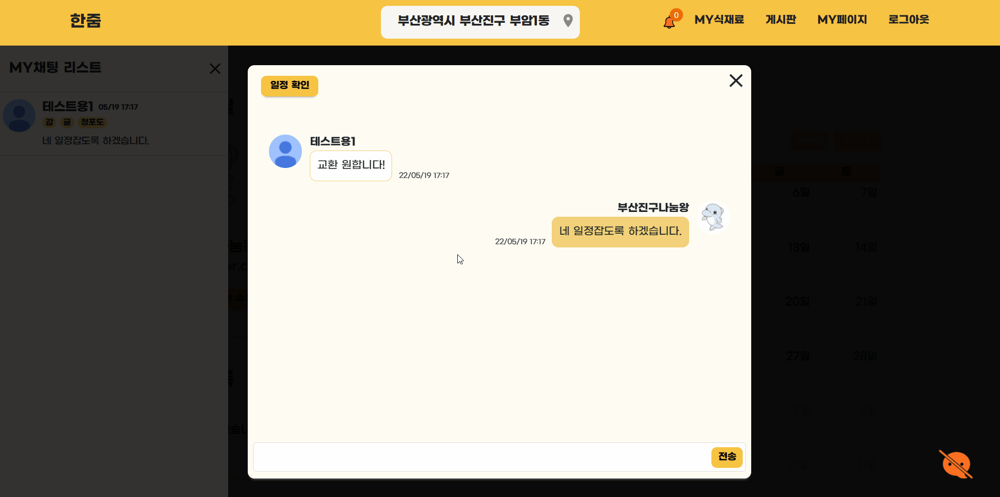

<br/><br/>

### 관리자

- 신고 내역 관리

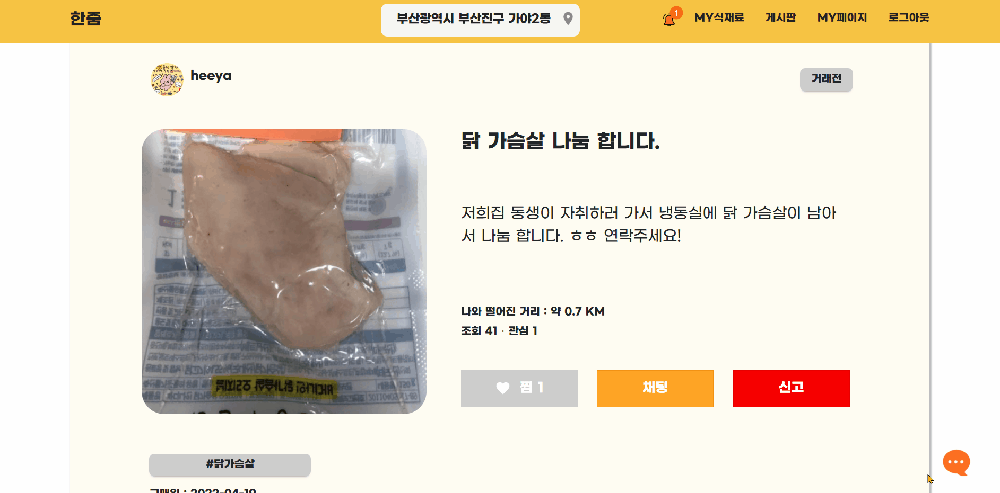

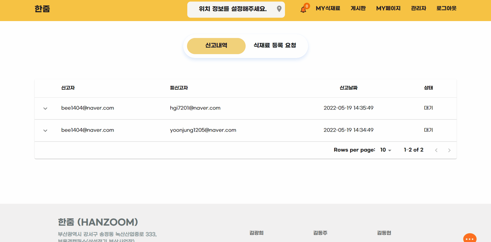

<br/>

- 식재료 등록 요청 관리

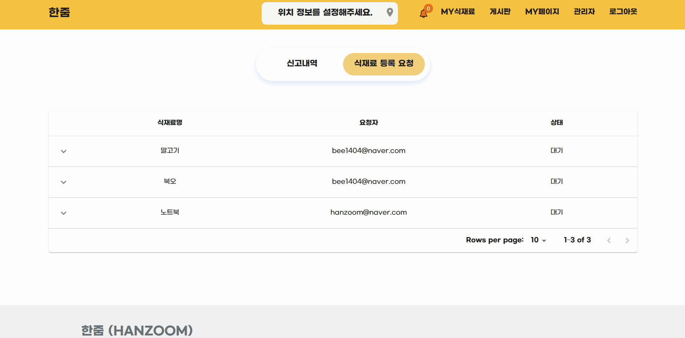

<br/>

- 식재료 등록 요청 알림


<br/>

<br/>

## 4. 프로젝트 진행

프로젝트 진행 기간동안 전면 비대면으로, 온라인으로 진행되었기에 특히나 진행 방식과 소통 방법이 중요했습니다. 그래서 우리는 `Agile` 방법으로 프로젝트를 진행했고, Jira를 사용한 스프린트 관리, Notion을 통한 문서 정리, Discord를 활용하여 커뮤니케이션 소통을 하였습니다.

<br/>

## 🏞Git Flow

git flow 사용을 위해 `우아한 형제들`의 [git flow 사용](https://techblog.woowahan.com/2553/)을 참고했습니다. 각자 맡은 기능에 맞게 `feature` 브랜치를 생성하고, 완료된 기능은 `develop`에 merge하여 사용했습니다. 충돌 상황을 최소화하고자 매일 오전 스크럼에 `develop` 최신 버전을 `pull`받고 시작할 것을 강조했습니다.

또한 `commit message` 는 `[feature/역할/기능] git 컨벤션` 와 같이 통일하여 작성했습니다.

```update : 기존의 기능 수정
- add : 새로운 기능 추가
- update : 기존의 기능 수정
- delete: 기존의 파일 삭제
- fix : 버그를 고친 경우
- rename : 이름 변경이 있을 때
- chore : 빌드 태스트 업데이트, 패키지 매니저를 설정하는 경우
- test : 테스트 코드 추가, 테스트 리팩토링
- build : 시스템 또는 외부 종속성에 영향을 미치는 변경사항 (npm, gulp, yarn 레벨)
- ci : CI관련 설정 style : 코드 의미에 영향을 주지 않는 변경사항 (포맷, 세미콜론 누락, 공백 등)
- refactor : 성능 개선
```

<br/>

## 📋 Jira

매주 월요일 오전 회의에서 차주에 진행되어야 할 이슈를 백로그에 등록했습니다. 금주에 완료하지 못한 이슈나, 앞으로 진행할 이슈들을 추가합니다.

- 에픽은 가장 큰 단위 기준으로 구성하였습니다.

- 스토리는 실제 유저 플로우를 고려하여 `홈페이지에서 로그인 창을 통해 로그인 한다` 와 같이 작성하였으며,

- 이슈는 스토리를 완료하기 위한 작은 업무 단위로 생성했습니다.
- 에픽링크 태그를 사용하여 이슈를 구별하기 쉽게 했습니다.
- 무엇보다 담당자와 스토리 포인트 설정, 현재 작업중인 내용 지라에 실시간으로 반영하는 것을 가장 중요하게 생각했습니다.

<br/>

## 📝Notion

모두가 공유해야할 자료 및 링크는 노션에 정리했습니다. 특히 `userflow`와 같이 여러번 다시 봐야하고 중요한 정보들은 특히 노션에 공유하여 불필요한 커뮤니케이션 리소스를 줄이기 위해 노력했습니다.

프로젝트 컨벤션, 문서, 참고자료, 산출물, 데일리 스크럼 등을 설정했습니다.

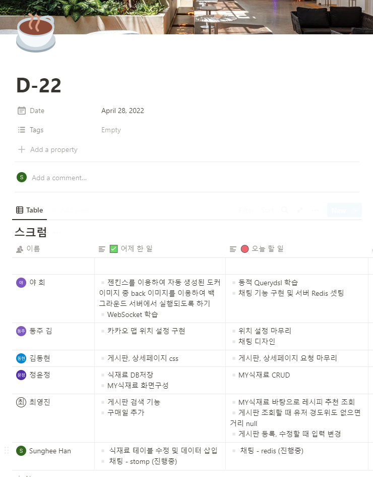

<br/>

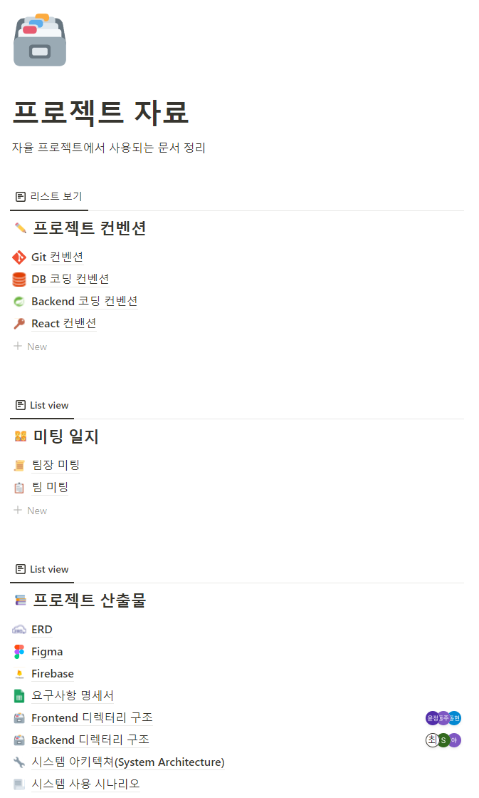

<br/>

## 5. 배포

서버는 AWS EC2 ubuntu를 사용했습니다

## (1). ⚙ 시스템 환경 및 구성

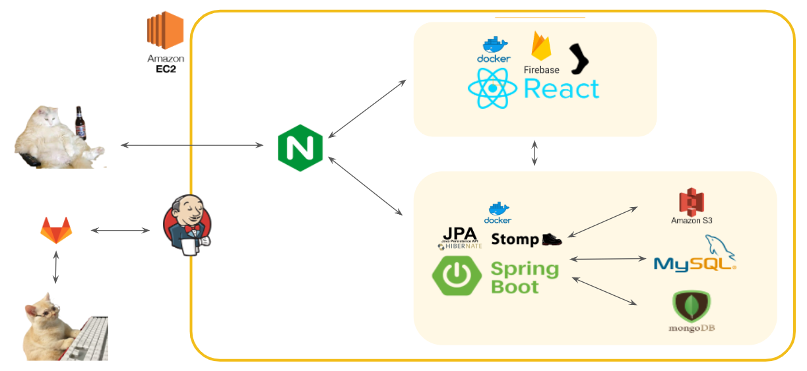

- OS: Windows10
- Backend Framework: Spring Boot 2.4.5
- Frontend Framework: React 18.0.0
- MySQL: 8.0.29-0ubuntu0.20.04.3 (Ubuntu)
- MongoDB: MongoDB 4.4.13
- WAS: Gradle
- JVM: openJDK (1.8.0_192)
- Node.js: 16.14
- Docker: 20.10.14
- WEB: Nginx (1.18.0)

<br/>

## (2). Docker

서로 다른 도커 이미지로 저장되어 있어 각각의 이미지를 실행시킵니다.

필요한 이미지들의 설정은 docker-compose.yml 파일에 작성합니다.

docker 내부는 같은 네트워크로 묶어주기 위해 docker-compose로 실행합니다.

<br/>

## (3). DevOps

`Jenkins`로 CI/CD를 구축하여 develop 브랜치에 `merge` 이벤트 발생시 build하도록 구성했습니다.

build 후 docker-compose를 실행하도록 했습니다.

<br/>

<br/>

## 6. UI / UX

## (1). 와이어프레임(Figma)

figma를 사용해 홈페이지의 초안을 작성합니다. 관련 레퍼런스를 참고하고, 서비스 특성에 맞게 제작했습니다.

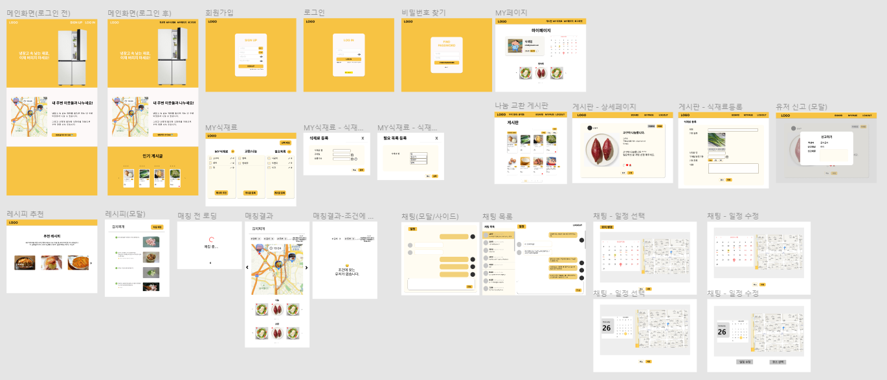

<br/>

<br/>

## 7. DB

## (1). ERD

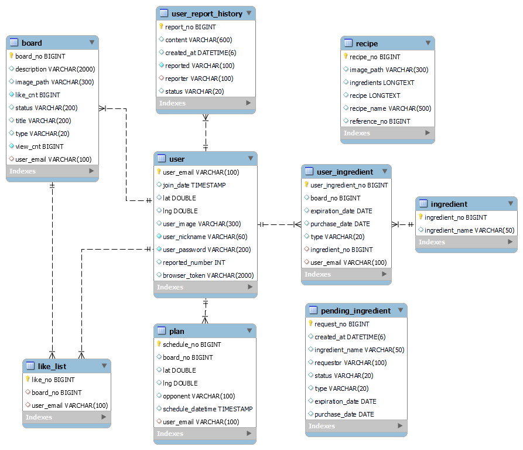

<br/>
<br/>

## 8. 팀원 소개 및 소감

## 🤴 팀원 소개

|                    [김광희](https://github.com/heeya15)                    |                   [김동주](https://github.com/kdongju)                   |                    [김동현](https://github.com/lewns2)                     |                  [정윤정](https://github.com/yoonjung1205)                  |                  [최영진](https://github.com/youngjin98)                   |                            [한성희](https://github.com/ehhclaire)                             |
| :------------------------------------------------------------------------: | :----------------------------------------------------------------------: | :------------------------------------------------------------------------: | :-------------------------------------------------------------------------: | :------------------------------------------------------------------------: | :-------------------------------------------------------------------------------------------: |
|  |  |  | 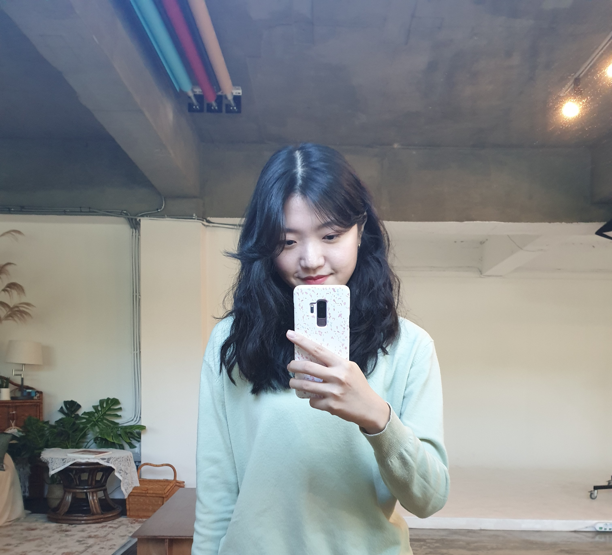 |  |  |
|                     Front-end<br/>Back-end<br/>Dev-Ops                     |                              Front-end<br/>                              |                               Front-end<br/>                               |                             Front-end<br/>Data                              |                           Front-end<br/>Back-end                           |                                    Front-end<br/>Back-end                                     |

<br/>

### 🐮🍅 소감

- **김광희** : 이번 자율 프로젝트를 하면서 처음으로 QueryDsl의 동적 SQL 쿼리를 공부하며 레시피 추천 기능을 구현해 보았고  React에 Media Query를 사용하여 반응형 UI를 공부하고 적용해 볼 수 있었습니다.  또한 채팅을 위해 Stomp를 학습했고 채팅 데이터를 MongoDB에 저장하기 위해 처음으로 서버에 배포하는 방법을 학습한 뒤 배포에 성공하였고 그 결과 로컬 MongoDBCompass에 연결까지 하여 채팅 구현 팀원이 채팅 데이터를 직관적인 GUI를 통해 확인 및 분석이 원활하게 할 수 있게 하였습니다.  모든 팀원들은 이전 까지 해왔던 프로젝트 경험으로 각자 맡은 역할에 책임감을 가지는건 물론 프로젝트에 열심히 임해 주어서 프로젝트가 잘 마무리 된 것 같습니다. Git Flow, Jira, Notion, Discord를 사용하여 비대면 상황이더라도 효율적으로 소통하고 협업을 할 수 있었습니다.  이번에도 ("Local에선 잘 실행 되는데 Server 배포한 곳에선 왜 안 되지?") 에러를 Jenkins를 하며 마주치게 되어 많이 힘들었지만, 코치님과 컨설턴트님이 도와주실려고 노력을 해 주셔서 잘 해결할 수 있었습니다. 마지막으로 6주 동안 비대면으로 개발 진행하면서 고생한 우리 "진정해 줘연" 팀원들 모두 수고했고 얼마 남지 않은 SSAFY 기간 다 같이 취뽀 화이팅!!!😀😀

  

- **김동주** : 이번 프로젝트를 하면서 좀 더 react에 관해 공부할 수 있었고, 적용해볼 수 있었습니다. 처음에는 어려웠지만, 하면 할수록 react hook이나 라이브러리 등과 같은 react의 장점들에 대해 느낄 수 있었고 나중에는 api 활용까지 순조롭게 할 수 있었습니다. 마지막 프로젝트였던 만큼 힘도 들었지만, 다 같이 힘내서 처음에 목표했던바 거의 구현하여 프로젝트 잘 마무리할 수 있어 좋았습니다.

  

- **김동현** : 프로젝트를 진행하며, 실 서비스 출시를 많이 생각하며 개발했습니다. 그런 까닭에 푸시 알람, PWA 등 사용자 편의를 위한 새로운 기술들을 도입해보았고, 실수를 해가며 많은 점을 배울 수 있었습니다. (그... 캐시로 힘들어했던 팀원들에게 죄송합니다...) 마지막으로 유능하고 책임감 넘치는 팀원들과 함께할 수 있어 영광이었습니다. 덕분에 좋은 영향을 받아, 앞으로의 여정에 큰 자산이 되리라 생각합니다. 다들 감사하고 고생많으셨습니다!💪

  

- **정윤정** : 이번 프로젝트를 하면서 처음으로 react를 사용해봤는데 낯설기도했지만 react라는 라이브러리를 접해본 정말 좋은 기회였습니다. 모든 기능을 다 경험해보지 않아 프로젝트를 마친 후 개인적으로 더 공부해야겠다고 생각했습니다. 프로젝트를 진행하면서, 라이브러리를 활용하여 드래그앤드랍 기능을 구현해본 점이 기억에 남습니다. 또한 이전에 사용해보지 않았던, 다양한 기술들(PWA, STOMP 등)을 이번 프로젝트에 적용하면서 또 하나 더 배워갈 수 있어서 좋았습니다. 끝으로 프로젝트를 기획했던 것 이상으로 성공적으로 마무리할 수 있어서 뿌듯했습니다! 마지막으로, 6주라는 긴 시간동안 꿋꿋이 같이해준 팀원들에게 고맙다고 말하고 싶습니다. 🥰 늦은시간까지 모두 잠도 마다하고 프로젝트 참여하느라 정말 고생많았어!! 🐥

  

- **최영진** : 프로젝트를 기획하면서 주요 기능들의 관계가 얽혀있어 ERD를 설계하는 과정부터 쉽지 않았던 것 같습니다. 헷갈릴 때마다 팀원들과 의논하면서 기능들을 정리하고 전체적인 틀을 잘 잡아갈 수 있었습니다.👍 이미 해본 경험이 있는 S3, pageable 등은 과정을 찬찬히 훑어보며 빠르게 진행하고자 노력했고 새로운 기능 자료 조사에 힘을 쏟았습니다. 조사한 자료가 모두 프로젝트에 도움이 된 것은 아니지만 사용자 매칭에 사용할 알고리즘을 찾아보며 Kruskal, Prim 알고리즘을 다시 한번 공부해 볼 수도 있었고 프로젝트에 실제로 이용한 해밀턴 순환 경로를 새롭게 배울 수 있었습니다. 또 여러 기능들을 개발하면서 팀원들의 도움을 바탕으로 원활히 한줌 프로젝트를 잘 마무리할 수 있었던 것 같습니다!!! 마지막으로 6주 동안 비대면으로 진행하면서 시간적으로 바쁘기도 하고 힘들었던 부분도 있었지만 Git, Jira, Notion을 활용해 더 많이 소통하고 또 적극적으로 도움을 주신 진정해줘연 팀원들 모두 고맙고 수고하셨습니다.😊

  

- **한성희** : 다른 프로젝트에 비해 기간도 짧았고 마지막 프로젝트인 만큼 시간상으로 체력적으로 힘들었던 프로젝트였습니다. 기획한 시스템이 기능적으로 얽혀있어서 구현과정에서 구조를 변경하는 일들도 있었고 예상 밖의 에러들도 많았지만 매주 Jira의 Scrum 작성을 통해 프로젝트 개발 스케줄을 관리하고 모든 팀원이 끝까지 지치지 않고 서로를 챙기면서 함께해주어서 프로젝트를 성공적으로 마무리할 수 있었습니다. 👏 처음 Socket 통신을 사용해보면서 우리 시스템의 채팅 요구사항에 맞게 잘 적용할 수 있을지 걱정이 많았고 아직 채팅 기능에 아쉬운 부분이 있지만 제대로 동작하는 채팅 기능을 완성해낼 수 있었습니다. 😁 AI, BlockChain 같은 도메인은 없었지만 FireBase, MongoDB, STOMP와 같은 다양한 기술 스택을 경험할 수 있어 후회 없는 프로젝트였습니다. 마지막 프로젝트를 함께할 수 있었던 팀원 모두에게 수고했고 감사하다는 말을 전하고 싶습니다. 고생했어 👊

  <br/>
