프로젝트에서 사용하는 외부 서비스 정보 문서

<br>

## 파일서버 - Amazon EC2

> Amazon EC2는 AWS(Amazon Web Services) 클라우드에서 확장 가능한 컴퓨팅 용량을 제공합니다. Amazon EC2를 사용하면 하드웨어에 대한 투자를 앞당길 필요가 없기 때문에 애플리케이션을 신속하게 개발하고 배포할 수 있습니다.
>
> 이를 통해 AWS의 환경을 컴퓨팅에 사용하고 컴퓨팅 리소스를 완전히 제어 할 수 있습니다. 컴퓨팅 요구가 변화함에 따라 Amazon EC2를 통해 몇 분 안에 새로운 서버 인스턴스를 가져오고 부팅 할 수 있으므로 용량을 빠르게 확장 할 수 있습니다. 또한 일반적인 실패 시나리오를 방지하고 개발자가 장애 복구 능력이 뛰어난 모바일 응용 프로그램을 개발할 수 있는 도구를 제공합니다.

> 

<br>

## Amazon EC2 인스턴스 생성하기

<br>

1. [AWS 홈페이지](https://aws.amazon.com/) 접속 후 로그인

   <br>

2. 메인화면 오른쪽 상단에 서비스를 누른 후, 컴퓨팅 메뉴에서 EC2를 선택

   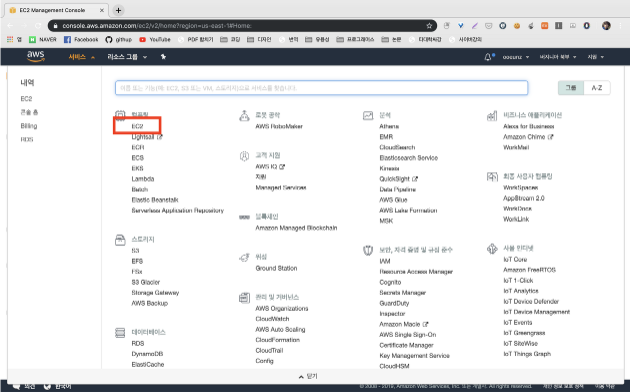

   <br>

3. 인스턴스 생성 클릭

   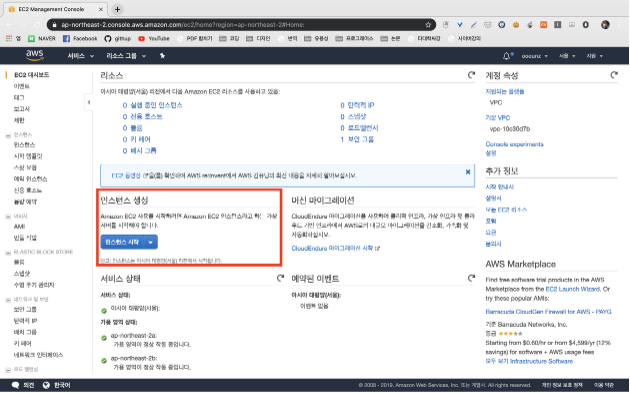

   <br>

4. Ubuntu AMI 선택 버튼 클릭

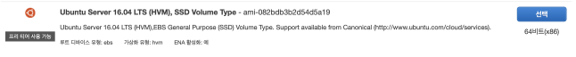

<br>

5. 보안 그룹 구성 누른 후, 규칙 추가 버튼 클릭

> 저희는 파일 서버로 사용하려면 퍼블릭 액세스가 허용이 돼야한다고 판단하여 퍼블릭 액세스 차단 기능을 활성화 하지 않았습니다!

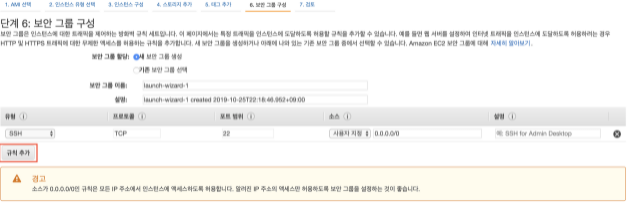

<br>

6. 선택한 옵션 확인 후, 검토 및 시작 버튼 클릭

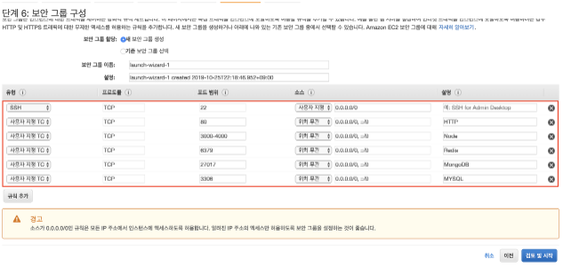
<br>

7. 새 키 페어 생성 선택 하여 키 페어를 입력 입력 후, 키 페어 다운로드 버튼을 눌러 컴퓨터에 키 페어를 보관

   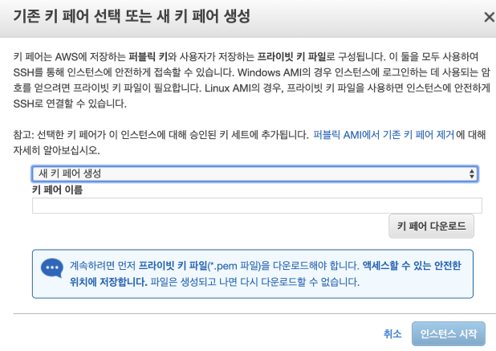<br>

## Amazon EC2 접속하기

<br>

1. [Mobaxterm 홈페이지](https://mobaxterm.mobatek.net/) 접속 후 설치

   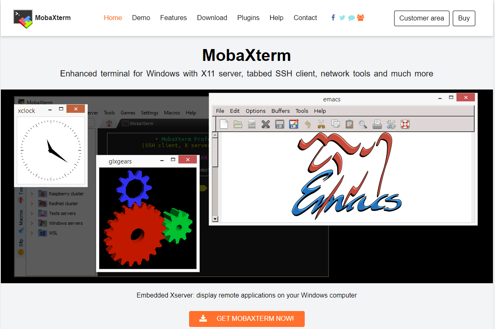

   <br>

2. Session 클릭

   <br> 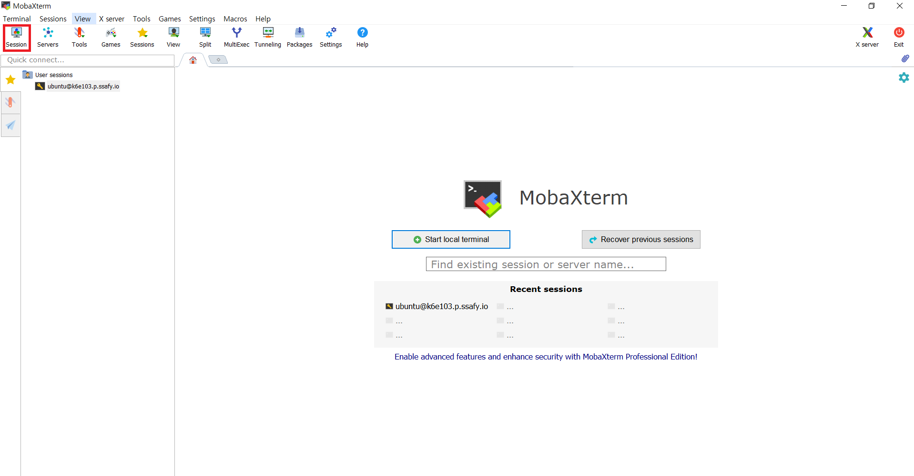

   <br>

3. Remote host에는 **부여 받은 접속 주소를 기입**하고, 아래의 Advanced SSH settings 탭에서 **use private key를 체크한 다음 부여 받은 pem키를 업로드 후 OK버튼 클릭**

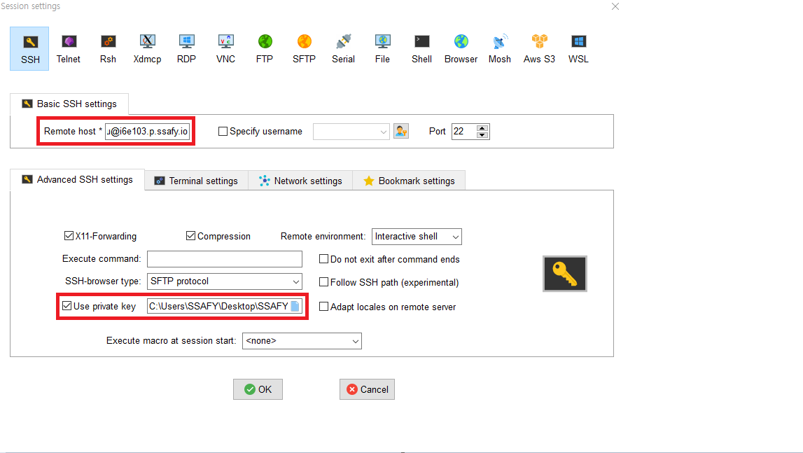

   <br>

4. `login as:` 프롬포트가 뜨면 `ubuntu`라 입력 후 엔터를 치면 접속 성공

   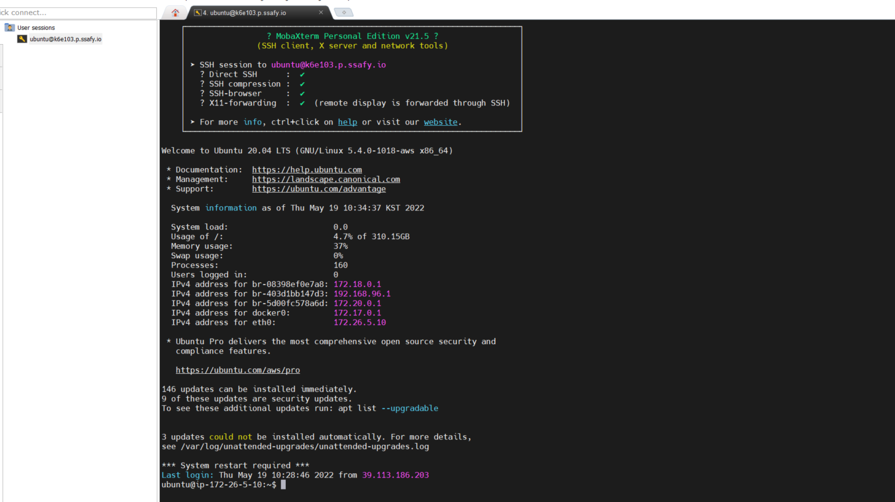

   <br>

<br>

<br>

## Amazon S3

> Amazon Simple Storage Service(Amazon S3)는 업계 최고의 확장성과 데이터 가용성 및 보안과 성능을 제공하는 객체 스토리지 서비스입니다. Amazon S3는 사용하기 쉬운 관리 기능을 제공하므로 특정 비즈니스, 조직 및 규정 준수 요구 사항에 따라 데이터를 조직화하고 세부적인 액세스 제어를 구성할 수 있습니다. Amazon S3는 99.999999999%의 내구성을 제공하도록 설계되었으며, 전 세계 기업의 수백만 애플리케이션을 위한 데이터를 저장합니다.

> 

<br><br>

### Amazon S3의 장점

1. 일반적인 파일 서버는 사용자 트래픽이 증가하면 스토리지 증설 작업을 해야하지만 S3는 시스템적으로 트래픽 증가에 대한 처리를 미리 해두었기 때문에 파일 서버 관리자는 별도의 처리를 해주지 않아도 됩니다.
2. 저장할 수 있는 파일 수의 제한이 없습니다.
3. 버킷마다 인증 시스템을 설정할 수 있어 보안이 좋습니다.
4. HTTP와 BitTorrent 프로토콜을 지원합니다.
5. REST, SOAP(HTTPS만 가능) 인터페이스를 제공합니다.
6. 버전관리 기능을 사용하면 사용자가 실수할 경우에도 복원이 가능합니다.

<br><br>

### Amszon S3 용어 설명

- bucket
  - S3에서 생성되는 최상위 디렉토리이며 디렉터리와 객체를 저장하는 컨테이너입니다. 버킷의 이름은 S3에서 유일해야 하며, 버킷 단위로 region을 지정할 수 있고, 버킷 별로 접근 제어 설정을 할 수 있습니다.
- Object
  - S3에 저장되는 데이터를 객체라고 하며, 파일과 메타데이터로 이루어져 있습니다.
  - 객체의 크기는 최대 5TB 까지 허용됩니다.
- Key
  - 버킷 내에서 객체를 찾기 위해 사용되는 고유 식별자입니다.
  - 보통 "디렉터리 + 파일명"으로 명명됩니다.
- Region
  - 버킷 생성 시 버킷의 위치를 지정할 수 있습니다. 버킷 위치를 어디에 지정하냐에 따라서 지연 시간 최적화, 비용 최소화 등이 결정됩니다.

<br><br>

### 설정

1. 버킷 만들기
   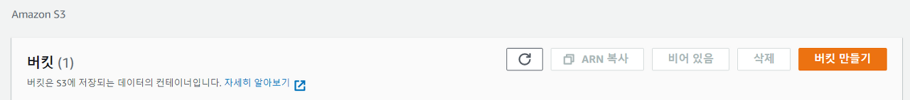

<br/>

2. 버킷 이름과 리전 선택
   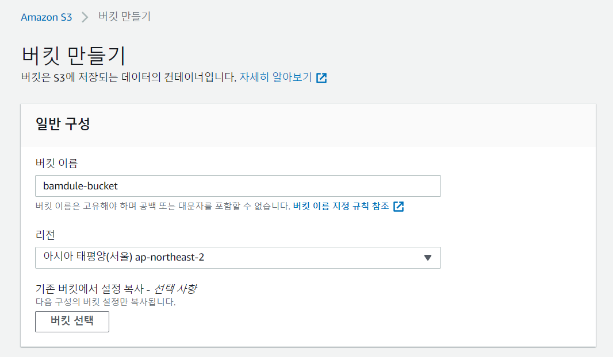

- 버킷 이름은 고유해야 하며, 리전은 서비스 지역에 따라서 설정

<br/>

3. 퍼블릭 액세스 설정

   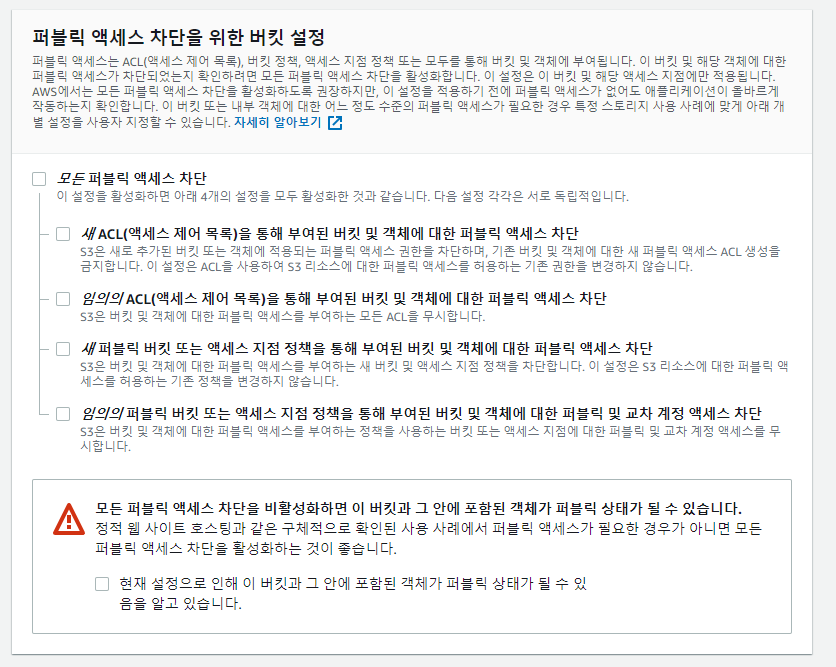


- 외부에 S3를 공개할 경우 모든 퍼블릭 액세스 차단 체크를 해제
- 외부에 공개하지 않고 내부에서만 사용하려면 모든 퍼블릭 액세스 차단을 체크
- 퍼블릭 액세스가 차단되었을 경우 IAM에서 AWSAccessKeyId와 AWSSecretKey를 발급받고 이를 이용해 S3 객체에 접근

<br/>

4. 버킷 버전 관리 및 기본 암호화

   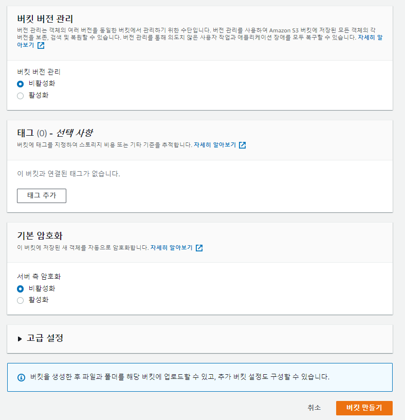

- **버킷 버전 관리기능**을 활성화하면 파일을 버전별로 관리하기 때문에 비용이 더 들지만 사용자가 실수로 파일을 삭제해도 복원 가능
- **기본 암호화**를 활성화하면 버킷에 저장되는 모든 새 객체를 암호화, 객체를 다운로드할 때 암호를 해독화

<br/>

5. 퍼블릭 정책 활성화
   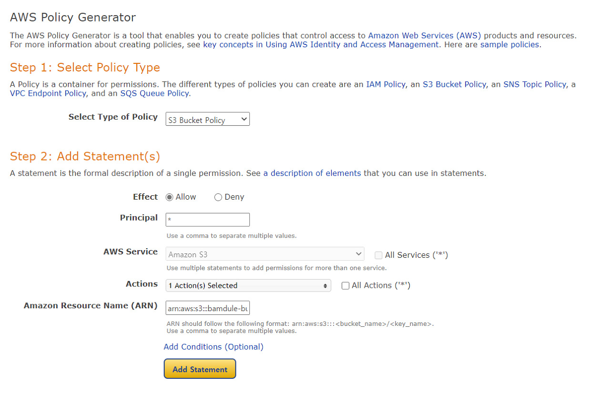

- Select Type of Policy: S3 Bucket Policy
- Effect: Allow
- Principal: \*
- AWS Service: Amazon S3
- Actions: 원하는 권한 선택
- Amazon Resource Name(ARN): arr:aws:s3:::bucket-name/\*

<br/>

6. 액세스 키 생성
   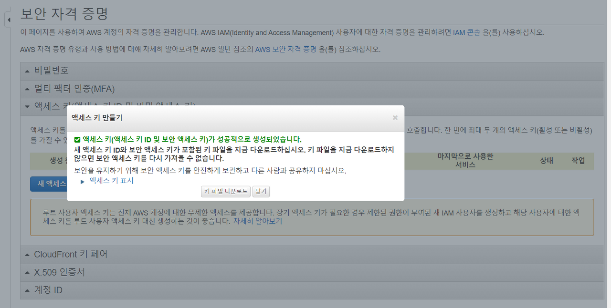

- IAM > 액세스 키 > 새 액세스 키 만들기
- 액세스 키는 AWSAccessKeyId와 AWSSecretKey로 구성
- AWSAccessKeyId와 AWSSecretKey는 절대 외부에 노출되어서는 안됨.

<br>

<br>

## Firebase 클라우드 메시징(FCM)

> Firebase 클라우드 메시징(FCM)은 무료로 메시지를 안정적으로 전송할 수 있는 교차 플랫폼 메시징 솔루션입니다.

> 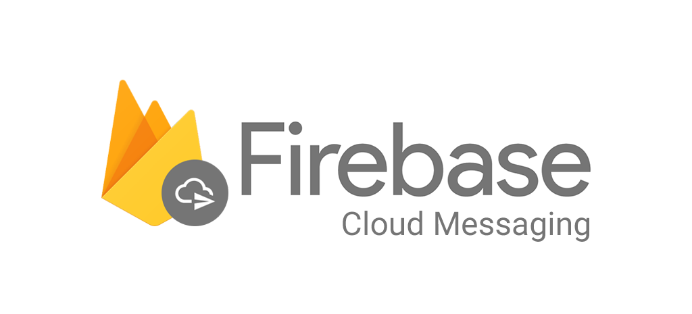

<br><br>

### Firebase 클라우드 메시징의 장점

1. FCM은 교차 플랫폼 메시지 솔루션이기 때문에 FCM을 이용해서 개발을 진행하면, 플랫폼에 종속되지 않고 Push 메시지를 전송할 수 있습니다.

2. FCM에서 제공하는 여러 기능들도 함께 사용 가능합니다.

3. 기능 구축에 시간과 비용이 줄어듭니다.

<br><br>

### 설정

1. Firebase 프로젝트 생성 및 앱 등록

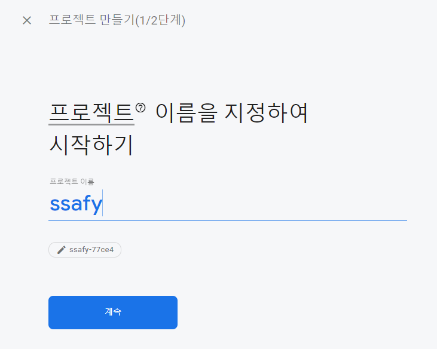

- Firebase Console에서 프로젝트 추가를 클릭합니다.
- 메시지가 표시되면 Firebase 약관을 검토하고 이에 동의합니다.
- 프로젝트 만들기를 클릭합니다. 기존 Google Cloud 프로젝트를 사용할 경우에는 Firebase 추가를 클릭합니다.

<br/>

2. Firebase SDK 설치 및 추가


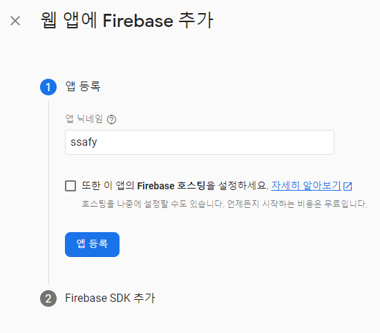

- npm을 사용하여 Firebase를 설치합니다.
  ```javascript
  npm install firebase
  ```
- App에서 Firebase를 초기화하고 Firebase 앱 객체를 만듭니다.

  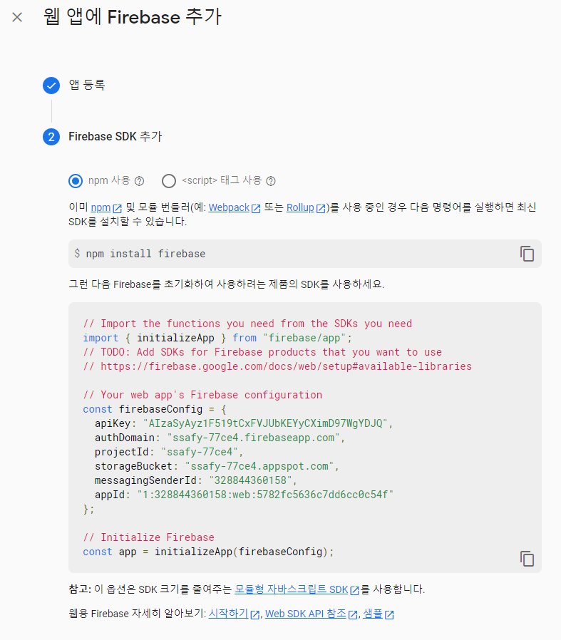

<br/>

3. 앱에서 Firebase 초기화 및 엑세스

   ```javascript
   import { initializeApp } from "firebase/app";
   import { getFirestore, collection, getDocs } from "firebase/firestore/lite";
   // Follow this pattern to import other Firebase services
   // import { } from 'firebase/<service>';
   
   // TODO: Replace the following with your app's Firebase project configuration
   const firebaseConfig = {
     //...
   };
   
   const app = initializeApp(firebaseConfig);
   const db = getFirestore(app);
   
   // Get a list of cities from your database
   async function getCities(db) {
     const citiesCol = collection(db, "cities");
     const citySnapshot = await getDocs(citiesCol);
     const cityList = citySnapshot.docs.map((doc) => doc.data());
     return cityList;
   }
   ```

<br/>

## Firebase RealTime Database

> Firebase의 Realtime Database는 NoSQL기반 cloud-hosted database다. 실시간으로 모든 클라이언트에서 데이터가 동기화 되고, 앱이 오프라인 상태라도 계속 사용할 수 있다. Data는 Json tree 형태로 저장됩니다.

> 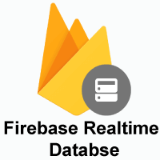

<br><br>

### Firebase RealTime Database의 장점

1.  앱에서 데이터베이스 사용을 위한 **서버 구성이 필요하지 않습니다**.

2.  변경 사항이 발생하면 **바로 변경 사항을 알려주기 때문에 데이터가 변경된 사항을 간단히 파악**하고 **쉽게 동기화** 할 수 있습니다.

<br><br>

### 설정

1. 데이터베이스 옵션 설정

<br/>

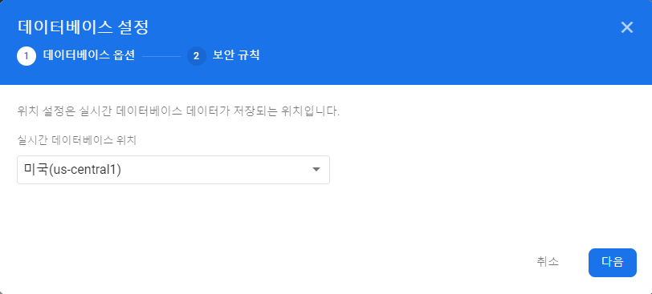

- Firebase Console의 실시간 데이터베이스 섹션으로 이동합니다. 기존 Firebase 프로젝트를 선택하라는 메시지가 표시됩니다. 데이터베이스 만들기 워크플로를 따릅니다.

<br/>

2. 실시간 데이터베이스 규칙 구성

<br/>

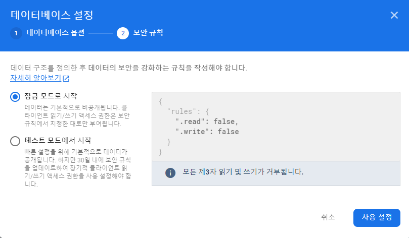

- 실시간 데이터베이스가 제공하는 선언적 규칙 언어로 데이터의 구조, 색인 생성 방법, 데이터를 읽고 쓸 수 있는 조건을 정의할 수 있습니다.

<br/>

<br/>

## STOMP(Simple/Stream Text Oriented Message Protocol)

> STOMP는 메시징 전송을 효율적으로 하기 위해 나온 프로토콜입니다.

> 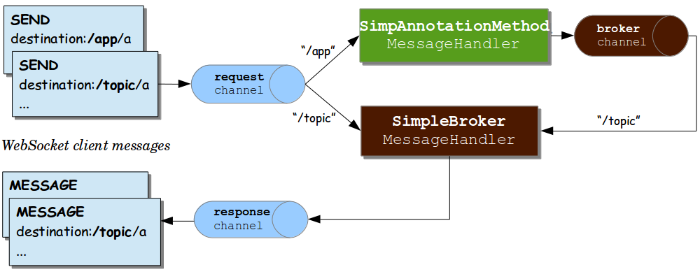

<br/>

### STOMP 특징

* TCP와 WebSocket과 같은 신뢰할 수 있는 양방향 스트리밍 네트워크 프로토콜에서 사용할 수 있습니다.
* 기본적으로 pub/sub 구조로 되어있어, 메세지를 전송하고 받아 처리하는 부분이 확실히 정해져 있습니다.
* http와 마찬가지로 frame을 사용해 전송하는 프로토콜입니다.

<br/>

### Pub/Sub 구조

Pub/Sub 이란 메시지를 공급하는 `주체와 소비하는 주체를 분리`하여 제공하는 메시징 방법입니다. 기본적인 컨셉트를 예로 들면 우체통(topic)이 있으면 집배원(publisher)이 신문을 우체통에 배달하는 액션이 있고, 우체통에 신문이 배달되는 것을 기다렸다가 빼서 보는 구독자(subscriber)의 액션이 있습니다. 여기서 구독자는 여러명이 될 수 있습니다. Pub/Sub 컨셉트를 채팅룸에 대입하면 다음과 같습니다.


* 채팅방을 생성 : Pub/Sub 구현을 위한 topic이 하나 생성된다.
* 채팅방에 입장 : topic을 구독한다.
* 채팅방에서 메시지 보내고 받기 : 해당 topic으로 메시지를 발송하거나(pub) 메시지를 받는다(sub).

<br/>

### 채팅 서버

1) #### build.gradle에 WebSocket 및 STOMP 라이브러리 추가

```
# WebSocket 라이브러리 추가
spring-boot-starter-websocket

# STOMP 라이브러리 추가
stomp-websocket
```

<br/>

2) #### WebSocket Config 설정

* Stomp를 사용하기 위해 @EnableWebSocketMessageBroker를 선언
* WebSocketMessageBrokerConfigurer를 상속받아 configureMessageBroker를 구현
* pub / sub 메시징을 구현
  - 메시지를 발행하는 요청의 prefix는 /pub로 시작하도록 설정
  - 메시지를 구독하는 요청의 prefix는 /sub로 시작하도록 설정
* Stomp Websocket의 연결 endpoint는 /ws-stomp로 설정
  - URL : ws://localhost:8080/ws-stomp

<br/>

3. #### 채팅방 DTO 생성

- pub / sub 방식을 이용하면 구독자 관리가 알아서 되므로 웹소켓 세션 관리가 필요없어진다.
- 발송의 구현도 알아서 해결되므로 일일히 클라이언트에게 메시지를 발송하는 구현이 필요없어진다.

<br/>

4. #### 채팅방 Repository 생성

- 채팅방을 생성하고 정보를 조회하는 Repository를 생성
- DB나 저장 매체에 채팅방 정보를 저장하도록 구현한다.

<br/>

5. #### ChatController(Publisher) 구현

- @MessageMapping을 통해 Websocket으로 들어오는 메시지 발행을 처리
- 클라이언트에서 prefix를 붙여 /pub/chat/message로 발행 요청을 하면 Controller가 해당 메시지를 받아 처리
  - 메시지가 발행되면 /sub/chat/room/{roomId}로 메시지를 send한다.
  - 클라이언트에서는 주소 ( /sub/chat/room/{roomId})를 구독(Subscribe)하고 있다가 메시지가 전달되면 화면에 출력한다.
  - /sub/chat/room/{roomId} 주소는 채팅방을 구분하는 값이므로 pub / sub 에서 Topic의 역할이다.
- WebSockChatHandler가 했던 역할을 대체하므로 WebSocketChatHandler 삭제

<br/>

6. #### 구독자(Subscriber) 구현

- 웹 뷰에서 stomp 라이브러리를 이용해서 subscriber 주소를 바라보고 있는 코드만 작성하면 된다.

<br/>

7. #### 화면단 연결

* 라이브러리 추가

``` # socketjs, stompjs 사용을 위한
# socket.js와 stomp.js 라이브러리 다운로드
```

* 입장 시엔 위에서 설정한 endpoint인 ws-stomp로 서버 연결을 한 후 채팅방을 구독하는 액션을 수행한다.

- ws.subscribe("/sub/chat/room/"+vm.$data.roomId, function(message){.....})
  - 구독은 "/sub/chat/room/채팅방 번호"로 구독하고 있고, 이 주소를 Topic으로 삼아 서버에서 메시지를 발행
  - 채팅방에서 클라이언트가 메시지를 입력하면 서버에서 topic("/sub/chat/room/채팅방 번호")로 메시지를 발행(publish)
  - 구독자는 ws.subscribe에서 대기하고 있다가 발송된 메시지를 받아서 처리할 수 있다.

<br/>

<br/>

### 참고사이트

------

* [STOM로 채팅서버 고도화하기](https://daddyprogrammer.org/post/4691/spring-websocket-chatting-server-stomp-server/)
